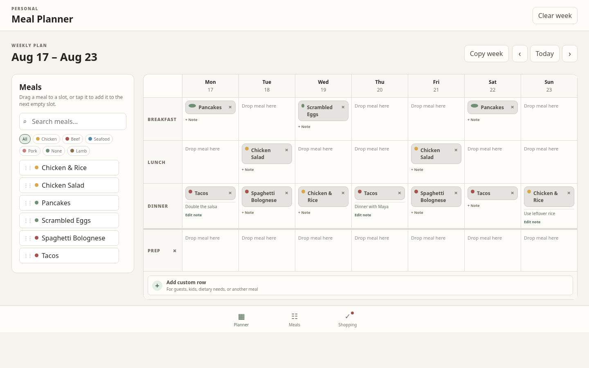
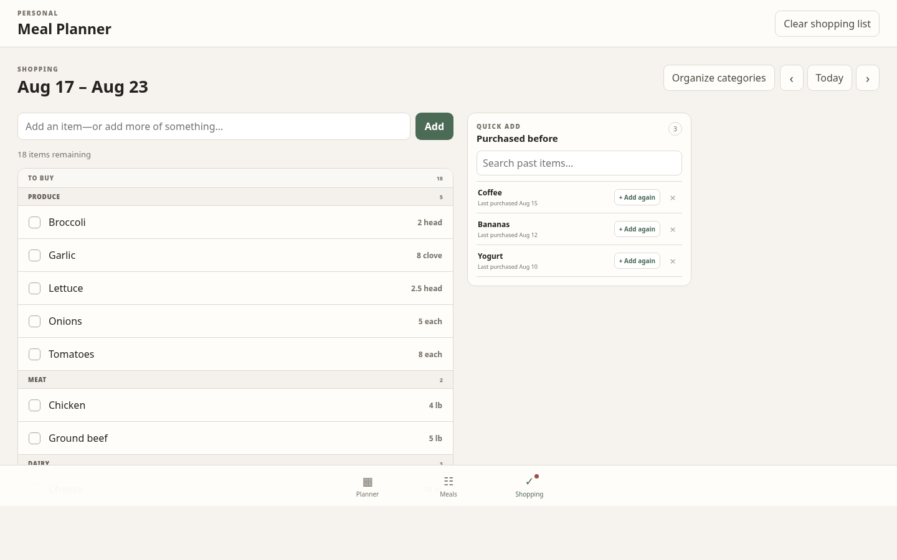
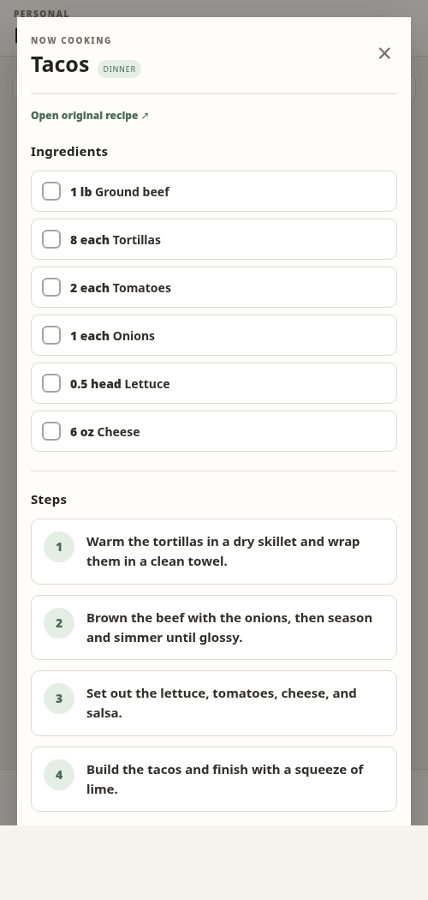

<p align="center">
  
</p>

<h1 align="center">Meal Planner</h1>

<p align="center"><strong>Plan the week. Shop the list. Start cooking.</strong></p>

<p align="center">
  A private, mobile-first home for meal plans, recipes, and the groceries that connect them.
</p>

## A look inside

<p align="center">
  
</p>

<table>
  <tr>
    <td width="68%">
      
    </td>
    <td width="32%">
      
    </td>
  </tr>
  <tr>
    <td align="center"><strong>One organized shopping list</strong></td>
    <td align="center"><strong>A focused cooking view</strong></td>
  </tr>
</table>

Meal Planner is built for the details of a real week: custom planner rows, reusable ingredients, one-off shopping items, store-order categories, purchase history, and the occasional need to buy milk twice.

Your household shares one live plan across devices. The local cache keeps the app responsive and available when the connection is not.

## Run it locally

Requires Node.js 22 or newer and a Supabase project.

```bash
git clone https://github.com/ppanko/meal_planner2.git
cd meal_planner2
npm install
cp .env.example .secrets
npm run dev
```

Add your Supabase URL and publishable key to `.secrets`. Database setup and household-code enrollment are covered in [SUPABASE_SETUP.md](SUPABASE_SETUP.md).

## Commands

| Command | Purpose |
| --- | --- |
| `npm run dev` | Start the development server |
| `npm run build` | Typecheck and build for production |
| `npm run preview` | Preview the production build |
| `npm test` | Run the complete test suite |
| `npm run test:watch` | Run tests while developing |
| `npm run test:coverage` | Generate a coverage report |
| `npm run typecheck` | Run strict TypeScript checks |

## Under the hood

React, TypeScript, Vite, Supabase, and `dnd-kit`. The test suite uses Vitest, Testing Library, jsdom, and an in-memory IndexedDB implementation.

Planner data is cached in IndexedDB and synchronized through Supabase Realtime. Household access is protected by anonymous authentication, enrollment, and Row Level Security; the private household code is never bundled with the app.

## Deploy

The included GitHub Actions workflow tests, builds, and deploys `master` to GitHub Pages. Add these repository secrets before running it:

```text
SUPABASE_URL
SUPABASE_PUBLISHABLE_KEY
SUPABASE_STATE_ID
```

The PWA uses a relative base path, so it works from a GitHub Pages project URL without additional routing configuration.
